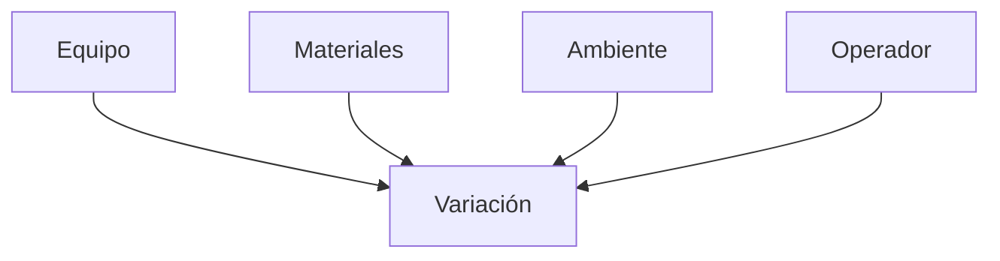
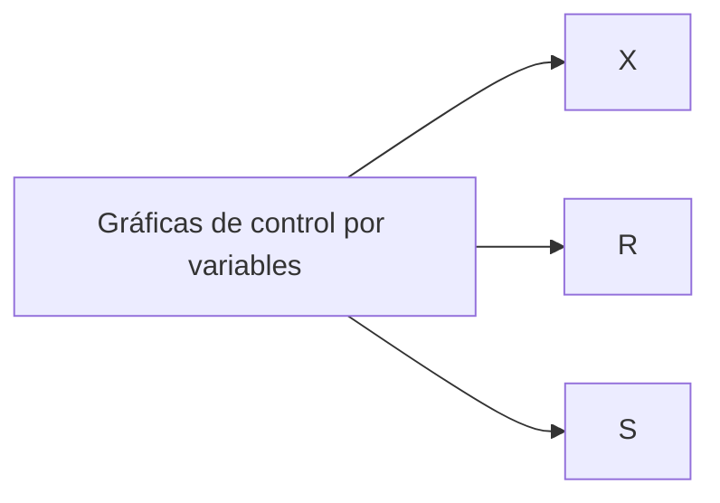

## COLECTA DE DATOS
---
#### ***VARIACIÓN*** : Es una ley de la naturaleza, porque no existen 2 elemento naturales en cualquier categoría que sean exactamente iguales.

- Se mide en una escala numérica, ejemplos:
	- Largo
	- Ancho
	- Temperatura
	- Volumen
La #variación se presenta por:

---
## ___GRÁFICAS DE CONTROL___

- Registro gráfico de calidad de determinada característica.
- Muestra si el proceso está o no en un estado estable.
- Se utilizan para aquellas característica que se pueden medir #cuantificable 

