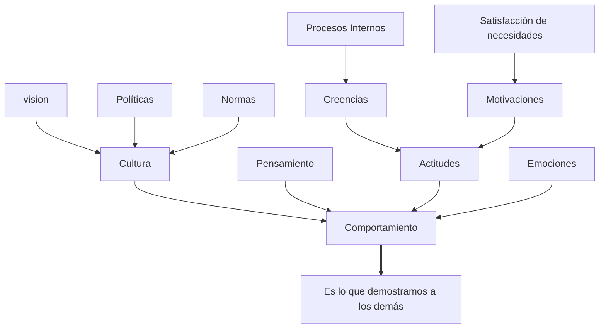
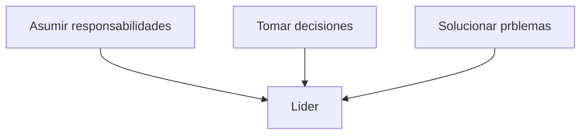

# Liderazgo En Seguridad y Medio Ambiente
---

#### ¿Por qué nos ponemos en riesgo? Si conocemos que puede ser mortal 
- Por valentía
- Por prisa
- Por distracción
- Por cansancio
A esto se le conoce como =="Comportamiento crítico o arriesgado"==

#### ¿Por qué dañamos el medio ambiente? 
Si sabemos que estamos contaminando nuestro único hogar

#### ¿Cómo cambiamos estas conductas?
Para poder cambiar el comportamiento de las personas, lo que debemos saber es:
- Las necesidades de la persona
- Su pensamiento
- Sus emociones
- Sus actitudes
- Su cultura y valores

### PIRÁMIDA DE NECESIDADES:

![[Pasted image 20230604234641.png]]

---
# EMOCIONES

Se necesitan para lo siguiente

FORMA 1 | SIMPLIFICADO 
:--: | :--:
Autoconocimiento emocional | Conciencia de uno mismo
Autocontrol emocional | Autorregulación
Automotivación | 
Reconocimiento de emociones ajenas | Empatía

### Control de las Emociones Negativas

![[Pasted image 20230605002500.png]]

---
# LIDERAZGO

>_"Actividad de influenciar a la gente para se empeñe voluntariamente en el logro de los objetivos del grupo"_

## ¿Qué es ser un líder?
- Persona capaz de influir en los demás
- Consigue que cada miembro aporte lo mejor de sí;
- identificándolos con los objetivos
## ¿El líder nace o se hace?
>_Las habilidades innatas favorecen el desarrollo de un líder pero resulta más determinante la formación y la experiencia acumulada_

- Preparación y experiencia son aspectos de formación
- 